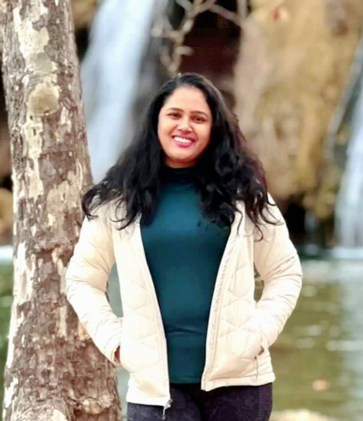

# SAI MANASA KORUMILLI

 

Email: manasa.korumilli15@gmail.com 
       saimank1@umbc.edu 

Contact: 240-853-8891

[LinkedIn Profile](https://www.linkedin.com/in/saimanasa-korumilli/)

## EDUCATION

**University of Maryland - Baltimore County (UMBC)**, Baltimore, MD  
Master’s degree in Data Science, May 2024; GPA - 3.78/4.0 
**Coursework**: Data Structures and Algorithms, Machine Learning, DBMS, Big Data, Data Mining, Statistical Analysis and Visualization with Python

**Sreenidhi Institute of Science and Technology**, Hyderabad, India  
Bachelor's degree in Mechanical Engineering, April 2018; GPA - 3.2/4.0  
**Coursework**: Core Mechanical concepts, Mathematics 1, 2, 3 (Calculus, Probability, Statistics), Data Structures, C, C++, Java Programming, Managerial Economics and Financial Analysis, Operations Research, Management Science, Banking Operations-Insurance and Risk Management

## TECHNICAL SKILLS

- Programming languages: C, C++, Java, Data Structures, Python, ‘R’, HTML, SQL Server
- Software: AVR studio, MATLAB, SPSS, Microsoft Office (Word, Excel and PowerPoint)
- Designing Software: AutoCAD, Fusion-360, CREO, Ansys, Solidworks
- Electronics: Peripherals of 8-bit Microcontrollers, UART
- Data Visualization: Tableau, Spreadsheet Modeling

## PROFESSIONAL EXPERIENCE

**YARDSTICK INNOVATIONS**, Hyderabad, India  
*Program Manager- Product Development*, May 2021 - May 2022

- Analyzed and evaluated end-to-end product development and life cycle of various products
- Customized and enhanced Virtual Simulations using HTML5 technology
- Coordinated with design, testing, content, operations, and marketing teams for program implementation
- Responsible for onboarding, workshops, demo sessions, and learning management system setup
- Achieved 98% client retention by supervising and resolving program issues

**ARGUS SYSTEMS**, Pune, India  
*Software Associate*, May 2019 - May 2021

- Developed and supported projects involving Java, JavaScript, HTML
- Troubleshooted application errors and provided user support
- Collaborated with developers to design algorithms and flowcharts
- Verified and deployed programs and systems

**TEACH FOR INDIA- Teach for All Network**, Hyderabad, India  
*Fellowship*, June 2018 - April 2019

- Instructed and mentored 180 high school students
- Designed robotics projects and conducted coding workshops
- Analyzed student performance and improved student outcomes through stakeholder engagement

## INTERNSHIPS

**National Thermal Power Corporation, Ramagundam**, Summer 2017

- Industrial Training in thermal plant operations and protection devices
- Worked on ‘Boiler maintenance - Pressure parts and Valves’

**KLR Industries Ltd, Hyderabad**, Spring 2017

- Accomplished a project on Manufacturing of Drill rods

**Ovkay - Goederen Private Limited**, Summer 2022

- Business Analyst Intern
- Analyzed digital marketing and overall business operations
- Contributed to major decision-making

## PROJECTS

- **Big Data and Analytical project on " Traffic Crashes of Chicago City"** using SQL and Python programming in Data Bricks platform and Jupyter notebook

- **A real-time machine learning project of " Analysis of a University newsletter "** using Grid Search, pipeline, and other ML algorithms as Logistic Regression, KNearest Neighbour Classifier, and Random Forest Classifier 
*Project link* - https://github.com/SaiManasaK15/data602/blob/main/602_Mid_Term%20(1).ipynb

- **A sentiment Analysis Project on "Movie Reviews** using Text processing, Clustering, and other ML algorithms such as Support Vector Machines, Decision trees, and Random forest classifier 
*Project Link* - https://github.com/SaiManasaK15/data602/blob/main/602-Sentiment_Project%20(1)%20(1).ipynb

- **GOKART**- Designed and fabricated a vehicle, won Best Designing award in Vishnu Karting Championship, India, Jan 2016

- **Smart Energy Meter**- Built with GSM Module, Arduino, and energy meter, automatically sends consumption data to user's phone, May 2018

- **Ball Follower using Image Processing**- Used OpenCV, Aug 2016

- **Emergency Watch**- Utilized Arduino UART and GSM module, designed to protect women and children, Jan 2018

- **Line Follower using IR Sensors and Arduino**- Shortlisted for final round at BITS Pilani ATMOS- Technical Fest ‘16

## RESEARCH, PUBLICATIONS AND PRESENTATIONS

- Published Patent (No.201841034913) on ‘Dynamic Speed Limiter Mechanism for four-wheelers for Indian Road conditions’

- Presented paper on ‘Power generation from Speed limiters’ in National level technical Symposium ‘Sreevision'

## LEADERSHIP & EXTRACURRICULARS

- Board Member at Sreenidhi Cancer Foundation, Feb 2017- May 2018

- Mentor at Society of Automotive Engineers – SAE-SNIST, June 2016 - April 2018

- Organizer and volunteer for technical and cultural events at SNIST, India
